# Praktikum3

Tugas pertemuan ke 6 Bahasa Pemrograman

Nama : Ramadhan Ardi Iman Prakoso

NIM : 312210722

Kelas : TI.22.C.9

Prodi : Teknik Informatika

Anda harus install Pycharm di https://www.jetbrains.com/pycharm/download/#section=windows , Dan anda pilih yang Community

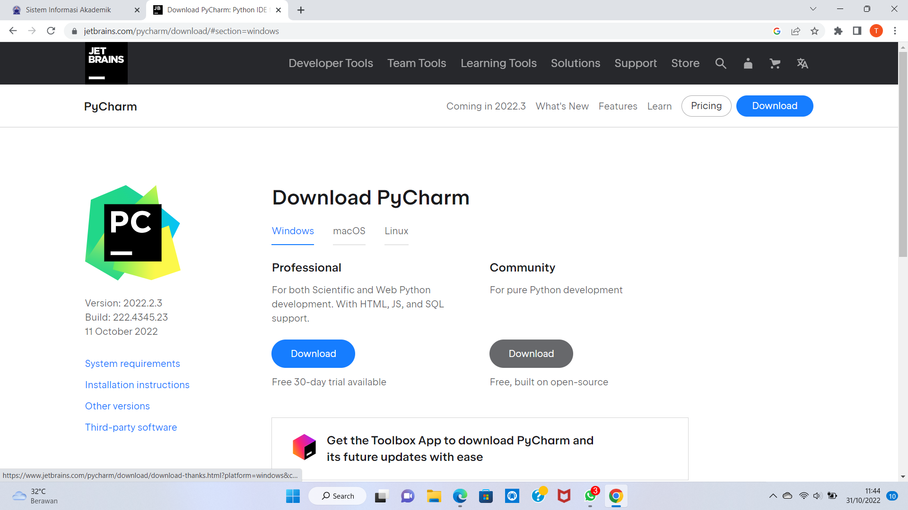

next saja semua perintahnya

tunggu hingga selesai

Jika sudah selesai maka program siap di gunakan

# Cara Menjalankan Pycharm

## Latihan 1

Pertama-tama anda harus Klik New project lalu kasih nama project anda(sesuai yang anda mau), Dan anda harus pilih yang Previously Configurred interperter lalu klik yang add interperter dan pilih yang System interperter dan anda klik yang versi Python anda seperti gambar di bawah ini

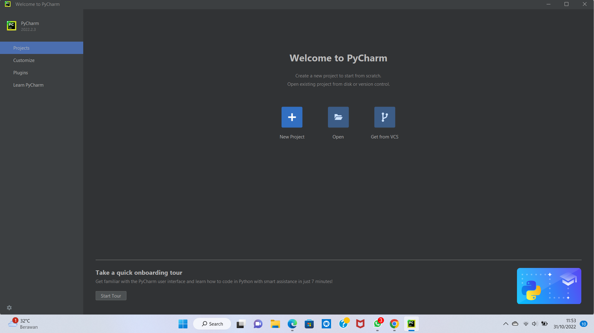

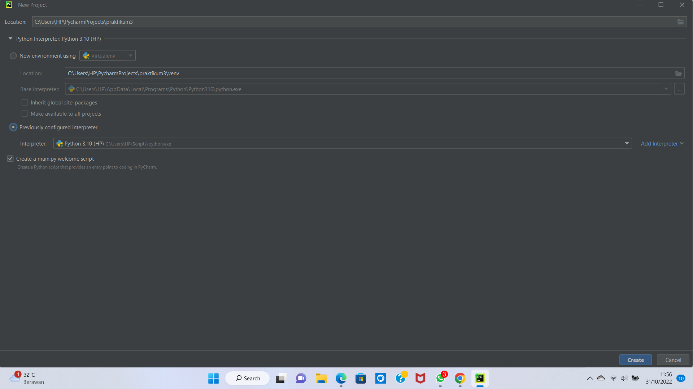

Selanjutnya anda membuat file Python baru di project anda tadi dan anda kasih nama file sesuai yang anda inginkan

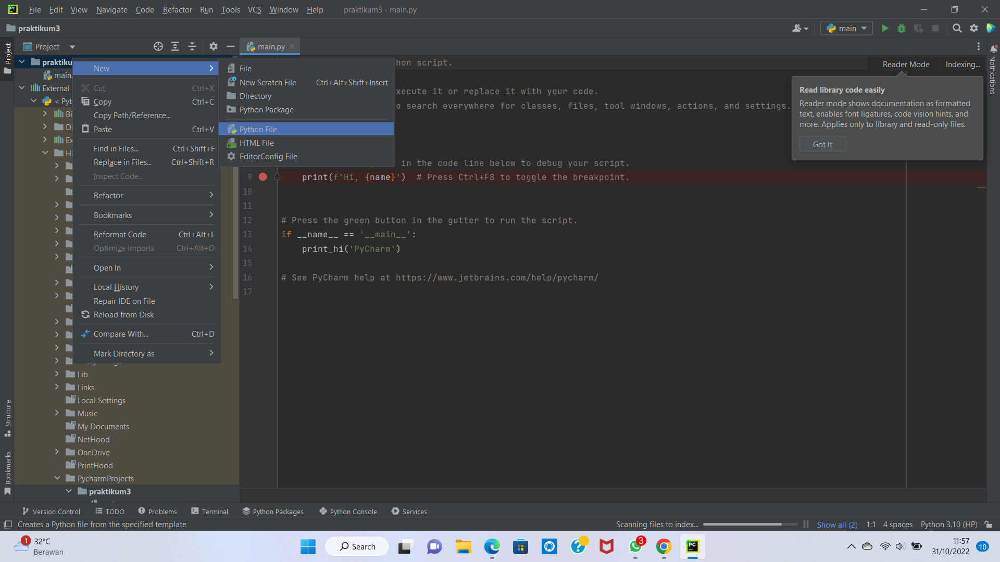

masukan code dari latihan1 anda lalu Run

# penggunaan end

print('A', end='')
print('B', end='')
print('C', end='')
print()
print('X')
print('Y')
print('Z')

# penggunaan separator
w, x, y, z = 10, 15, 20, 25
print(w, x, y, z)
print(w, x, y, z, sep=',')
print(w, x, y, z, sep='')
print(w, x, y, z, sep=':')
print(w, x, y, z, sep='-----')

# string format
print(0, 10 ** 0)
print(1, 10 ** 1)
print(2, 10 ** 2)
print(3, 10 ** 3)
print(4, 10 ** 4)
print(5, 10 ** 5)
print(6, 10 ** 6)
print(7, 10 ** 7)
print(8, 10 ** 8)
print(9, 10 ** 9)
print(10, 10 ** 10)

# string format
print('{0:>3} {1:>16}'.format(0, 10 ** 0))
print('{0:>3} {1:>16}'.format(1, 10 ** 1))
print('{0:>3} {1:>16}'.format(2, 10 ** 2))
print('{0:>3} {1:>16}'.format(3, 10 ** 3))
print('{0:>3} {1:>16}'.format(4, 10 ** 4))
print('{0:>3} {1:>16}'.format(5, 10 ** 5))
print('{0:>3} {1:>16}'.format(6, 10 ** 6))
print('{0:>3} {1:>16}'.format(7, 10 ** 7))
print('{0:>3} {1:>16}'.format(8, 10 ** 8))
print('{0:>3} {1:>16}'.format(9, 10 ** 9))
print('{0:>3} {1:>16}'.format(10, 10 ** 10))

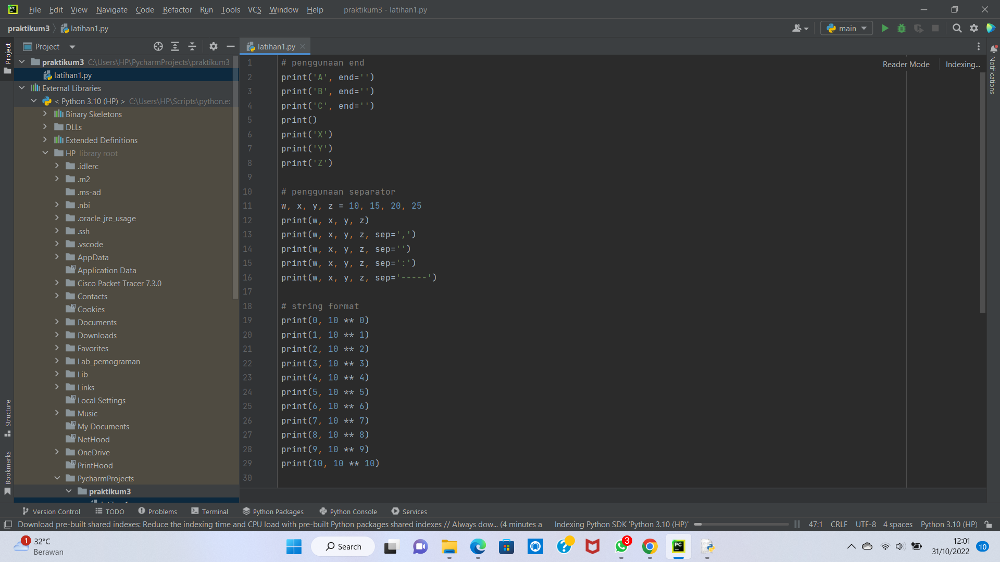

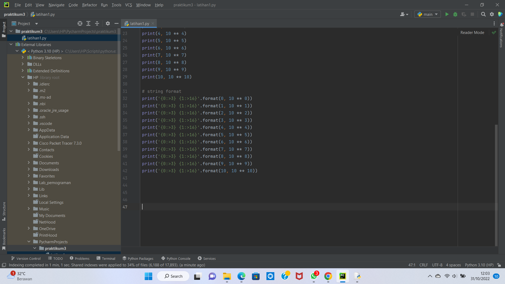

lalu hasil run nya

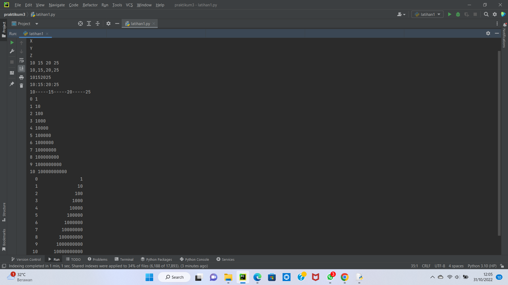

# Latihan 2

buat latihan baru "latihan2"

lalu masukkan code program

a=input("masukkan nilai a:")
b=input("masukkan nilai b:")
print("variabel a=",a)
print("variabel b=",b)
print("hasil penggabungan {1}&{0}=%s".format(a,b) %(a+b))

#konversi nilai variabel
a=int(a)
b=int(b)
print("hasil penjumlahan {1}+{0}=%s".format(a,b) %(a+b))
print("hasil penjumlahan {1}/{0}=%s".format(a,b) %(a/b))

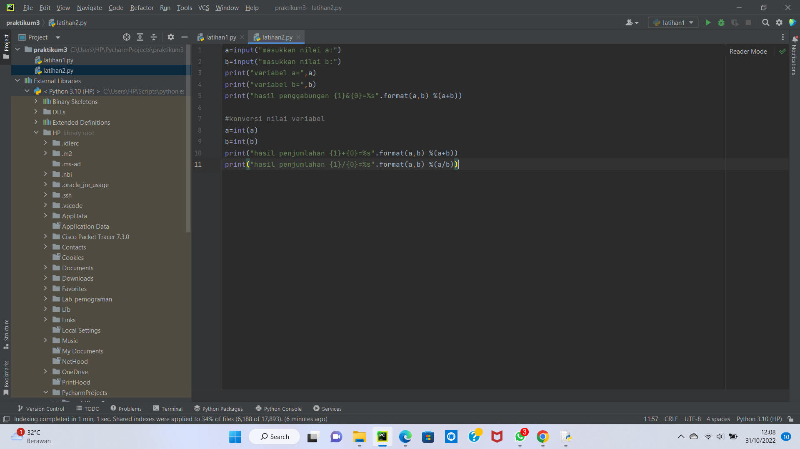

lalu hasil run nya menjadi

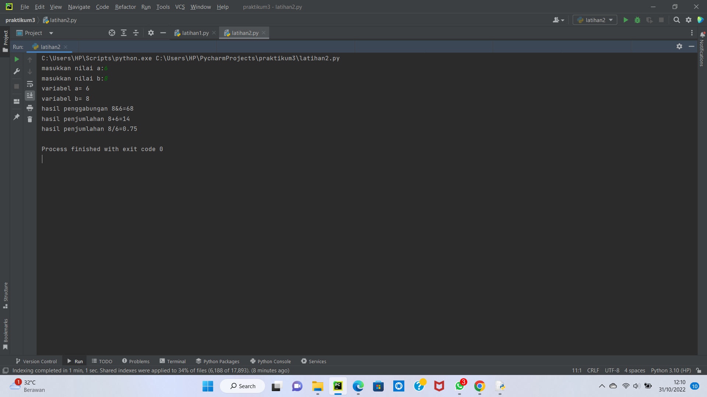

# Latihan 3

buat file baru "latihan3"

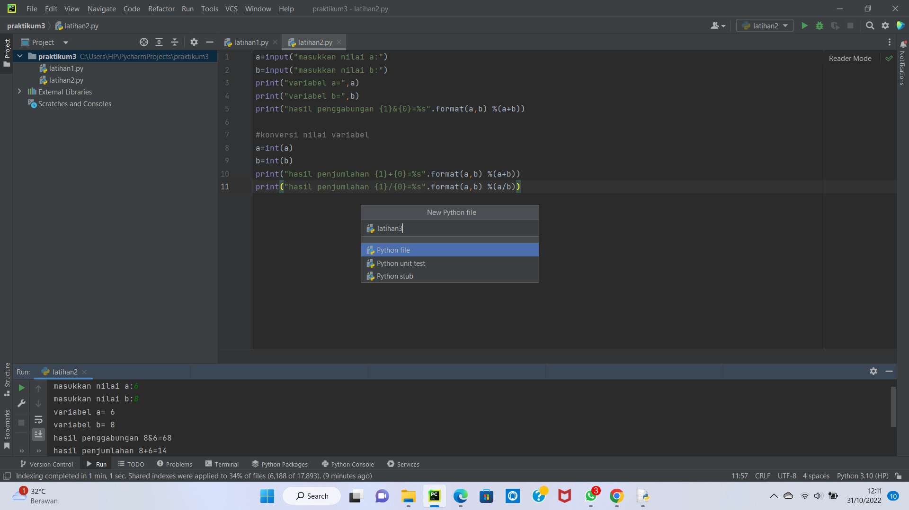

masukkan code programnya

string = ""

x = int(input("Masukkan angka :"))
bar = x
# Looping Baris
while bar >= 0:
# Looping Kolom Spasi Kosong
kol = bar
while kol > 0:
	string = string + "   "
	kol = kol - 1
# Looping Kolom Bintang Sisi Kiri
kiri = 1
while kiri < (x - (bar-1)):
	string = string + " * "
	kiri = kiri + 1
# Looping Kolom Bintang Sisi Kanan
kanan = 1
while kanan < kiri -1:
	string = string + " * "
	kanan = kanan + 1

string = string + "\n\n"
bar = bar - 1

bar = 1
# Looping Baris
while bar <= x:
kol = bar+1
# Looping Kolom Spasi Kosong
while kol > 1:
	string = string + "   "
	kol = kol - 1
# Looping Kolom Bintang Sisi Kiri
kiri = 0
while kiri < (x - bar):
	string = string + " * "
	kiri = kiri + 1
# Looping Kolom Bintang Sisi Kanan
kanan = kiri
while kanan > 1:
	string = string + " * "
	kanan = kanan - 1

string = string + "\n\n"
bar = bar + 1
print (string)

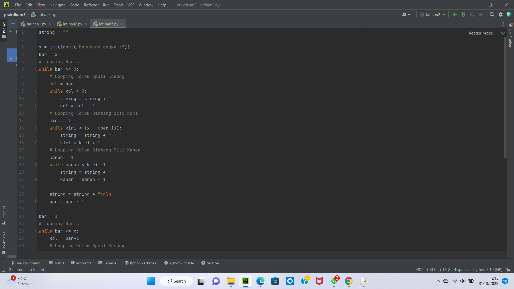

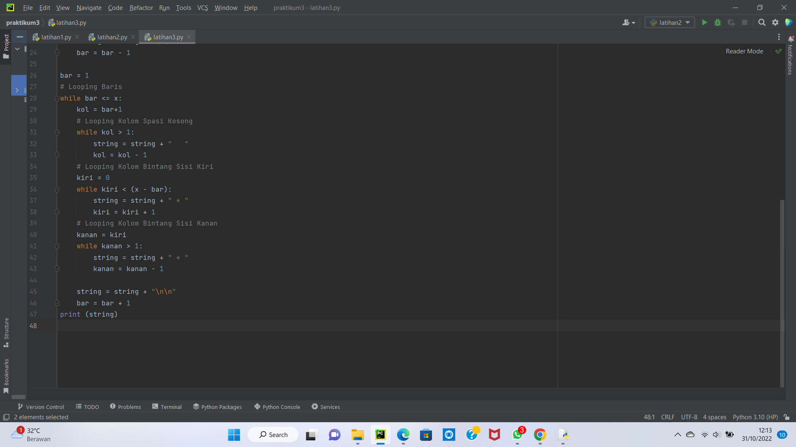

Hasil Run

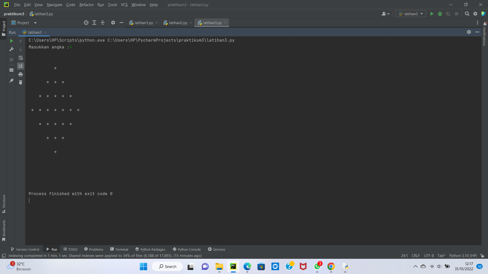

# Menghitung Luas Dan Keliling Lingkaran

buat file baru "praktikum3"

print('menghitung luas dan keliling lingkarang')
print('________________________________________')

r=float(input('masukkan nilai jari - jari :'))

phi=3.14
diameter=2*r

print('\nluasnya =', str("%.2f" % luas))
print('kelilingnya =', str("%.2f" % keliling))

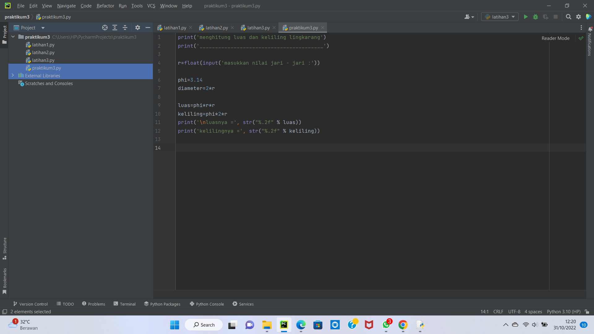

Hasil Run

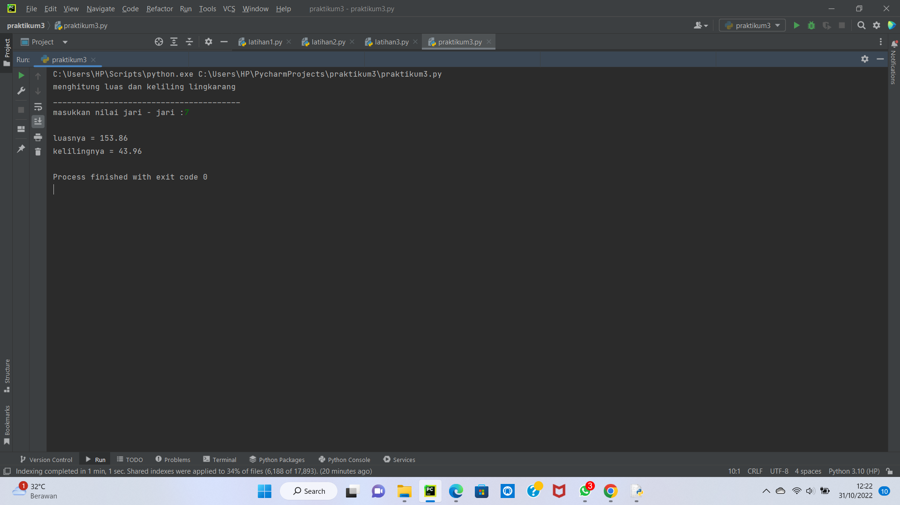

# Flowchart Menghitung luas dan keliling lingkaran

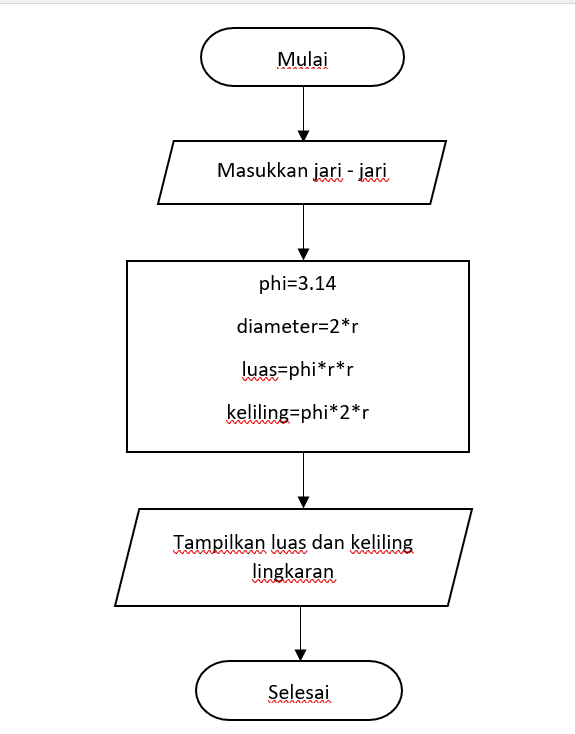

# SELESAI